# Confirmation Security Under a 600 s → 60 s Block-Interval Change on Bitcoin Cash

### An independent reproduction and robustness study of the quantitative security claims in CHIP-2025-03 (*Fablous*)

---

**Document type.** Independent reproduction, explanation, and stress-test. This report is **descriptive, not prescriptive**: it reports what the models and simulations say under stated assumptions. It does **not** recommend for or against CHIP activation.

**Reproduced work.** CHIP-2025-03, *Faster Blocks for Bitcoin Cash* (the *Fablous* proposal), `security.md`, commit `14391464` (`gitlab.com/0353F40E/fablous`). Referred to throughout as *the proponent's document* or *security.md*.

**Companion files.** Experimental plan `PLAN.md` · Claim matrix `CLAIMS.md` · Pre-registered hypotheses `HYPOTHESES.md` · Machine-readable results `results/tables/master_results.csv` (659 rows) · Figures `results/figures/fig01…fig12`.

**Reproducibility.** Full run via `scripts/run_all.py --trials 200000` (~4 m 48 s), master seed `20250924` (per-experiment seeds derived deterministically). Analytical values are exact (no sampling error). All simulation figures use the full run unless stated otherwise.

---

## Abstract

CHIP-2025-03 proposes reducing Bitcoin Cash's target block interval from ~600 s to ~60 s. Its security argument claims that a small number of deliberately chosen *fast* confirmations can be at least as safe as one *slow* confirmation, because the underlying Nakamoto race depends on the **number of confirmations**, not on wall-clock time. We independently reproduced the central quantitative claims and then stress-tested them under attacker models the proposal does not cover.

**Method.** We built an exact closed-form race model, two independent Monte Carlo simulators (an event-driven Bernoulli walk and a vectorized distribution sampler), and a faithful port of Stone's (2020) fork-matching dynamic program. We reproduced the primary claims (C1–C3) and the Stone thresholds (C6–C7), then ran eight robustness experiments (R1–R8) covering finite attack duration, attacker start-time and pre-mining, rational abandonment, temporary-majority hashpower, delayed acquisition of external SHA-256 hash, external-hash thresholds, and attack economics.

**Key results** (attacker share `q = 0.10`, tie policy `tie_win` unless noted).

| Finding | Value |
|---|---|
| 1 conf @ 600 s vs 1 conf @ 60 s | `0.201165` vs `0.201165` — **identical** (interval-invariant) |
| 2 conf @ 60 s | `0.056070` [0.0551, 0.0571] |
| 2×60 s safer than 1×600 s by | **≈ 3.6×** (0.201165 / 0.056070) |
| Double-spend break-even at 2 conf | **`X/C = 35.714` ≈ 36×** (exact) |
| Equal-chainwork (1×600 s vs 10×60 s) | `0.201175` vs `0.000005` — **count dominates work** |
| One pre-mined attacker block (2×60 s) | `0.056` → **`0.279`** (two blocks → `1.0`) |
| One honest-block head start (2×60 s) | `0.056` → **`0.0094`** |
| Cost per unit normalized work | `600`, constant across all policies (interval-invariant) |

**Conclusions.** The proponent's central mathematical claims replicate exactly. Interval invariance (C1) is a theorem of the race model, not an artifact. Confirmation *count* — not chainwork and not wall-clock time alone — is the dominant security variable. The ~36× economic target reproduces to machine precision. The advantage is, however, **conditional**: it requires the merchant to actually wait for the extra confirmation(s) and assumes the attacker does not begin with a pre-mined lead. Two caveats bound the evidentiary reach of this work: (i) the simulations share the same underlying model assumptions as the closed form, so they verify the *mathematics*, not the *world*; and (ii) the robustness experiments expose the model's sensitivity to assumptions (head start, acquisition delay) but cannot validate those assumptions empirically. The study's contribution is therefore a rigorous confirmation of the claims *as model statements*, plus an explicit map of where the model's assumptions carry the weight.

**Keywords:** Bitcoin Cash, CHIP-2025-03, faster blocks, confirmation security, Nakamoto race, double-spend, probabilistic finality, Monte Carlo, interval invariance.

---

## 1. Introduction

Bitcoin Cash currently targets a block every ~600 s. CHIP-2025-03 ("Faster Blocks") proposes a ~60 s target, motivated by faster settlement and finer-grained confirmation. A block-interval change of this magnitude raises an obvious security question: does making blocks ten times faster make payments ten times less safe per confirmation?

The proponent's answer, in `security.md`, is that it does not — because the security-relevant process is the *race* between an attacker's secret chain and the honest chain, and that race is indexed by **block count**, not by wall-clock time. From this the proposal derives a set of quantitative claims: one fast confirmation carries the same minority-race security as one slow confirmation (C1); two fast confirmations can be safer than one slow confirmation (C2); the economic break-even target is unchanged in dimensionless terms (C3); and various fork-matching, selfish-mining, and timewarp properties are preserved (C6–C11).

This report is an **independent reproduction and stress-test** of those claims. Our guiding principle is *reproduce first, explain second, stress-test third, generalize only as far as the evidence permits*. Concretely, we ask:

1. Do the proponent's headline numbers replicate under an independently implemented model? (§4)
2. *Why* do they hold — can the result be decomposed into interpretable components? (§4.4)
3. Do the claims survive when the attacker is allowed to behave in ways the proposal does not model — start early, pre-mine, give up, rent hashpower, acquire it late? (§4.10)
4. Which claims are *derived* by the proponent, which are *asserted* but not derived, and what does that mean for their evidentiary status? (§2.3, §5.2)

We emphasize at the outset what this study is not. It does not model propagation delay, orphan rates, network topology, or eclipse/partition dynamics; those are scoped as optional in the plan and are not exercised here. It does not assert any empirical cost or availability of SHA-256 hashpower. And it takes no position on whether the CHIP should activate.

---

## 2. Background

### 2.1 The proposal in one paragraph

CHIP-2025-03 reduces BCH's target block interval by a factor of ten, from ~600 s to ~60 s, keeping total hashrate (and therefore chainwork per hour) unchanged. Per-block chainwork and per-block difficulty drop to roughly 1/10; chainwork, difficulty, and coinbase *per hour* are unchanged. The proposal's own framing is that the only thing that changes is the **granularity of work** and the **cadence of confirmation events** — not the security budget per unit time.

### 2.2 The proponent's security argument

The security argument in `security.md` rests on a small number of load-bearing statements, of which two matter most for this report:

1. **Interval invariance.** "Hashpower relationships are independent of target block time: whether the target is 1 minute or 10 minutes, a miner with 50% hashpower has a 50% chance of winning the next block. The calculations from the whitepaper are independent of target block time and apply equally to 1-minute blocks." (`security.md` §"PoW fundamentals", lines 83–84.) The proposal's Preserved/Changed summary table lists *"Probabilistic finality — Whitepaper per confirmation finality calculations"* under **Preserved**.

2. **Count-monotonicity of the race.** The double-spend overtake probability is `P = I_q(m, m)` (regularized incomplete beta), and the parked continuation is `I_q(l + 2k, k)`; neither carries a time term. The document reinforces this in prose: *"Probability depends on block count, not wall-clock time"* (line 828); *"security against minority hashpower is faster achieved with faster blocks, because their probability rapidly reduces with block count"* (line 890); and *"ten times as many confirmation events per wall-clock embargo decay a minority attacker's survival probability ten times faster in block-count terms"* (line 900).

From (1) and (2), the fast-block advantage follows: waiting for two fast confirmations takes ~120 s of wall-clock time but delivers **two** confirmation events, and race probability is governed by the count.

### 2.3 What the proponent *derives* versus what he *asserts*

A central contribution of this report is to separate these two categories. The distinction is not a criticism of the proposal; it is an audit of which claims are backed by derivation and which are backed by assertion.

| Claim | Proponent's treatment | Our assessment |
|---|---|---|
| **C1** interval invariance | **Derived.** Follows directly from the race algebra (`λ_a/(λ_a+λ_h) = q`); no time term. | Supported, exact. |
| **C2** 2×60 s safer than 1×600 s | **Asserted.** Neither `security.md` nor `readme.md` computes the exact 2×60 s vs 1×600 s pairing. The document's explicit quantitative comparison is a *different, equal-wall-clock* pairing: 1×10 min vs 10×1 min (line 899), and 10×10 min vs 100×1 min (lines 911–913). | Derivable from C1 + count-monotonicity; our analysis supplies the magnitude (≈3.6×). |
| **C3** ~36× coinbase target | **Derived and tabulated.** `X/C = (m−1)/P` with `P = I_q(m,m)`. | Reproduced to machine precision. |
| **C4** majority cost/hour ~unchanged | **Conceptual.** Numerical example only "Partial." | Supported per unit normalized work (R8). |
| **C5** external SHA-256 hard to acquire reactively | **Asserted, not derived.** Claim matrix records derivation = No, numerical = No. | Parameterized (R5/R6); no empirical claim asserted. |
| **C6/C7** fork-matching thresholds rise | **Derived via Stone's DP.** | Reproduced via faithful port. |
| **C8** ~33% sustains a split | **Derived.** | Consistent. |
| **C9** minority security improves at equal wall-clock confirmations | **Derived.** | Supported. |
| **C10** selfish-mining threshold independent of interval | **Derived.** | Analytical only. |
| **C11** ASERT timewarp resistance preserved | **Derived.** | Analytical only. |

> **In plain terms.** Most of the proposal's security claims are genuine derivations. But the flagship comparison — "two fast confirmations beat one slow one" — is *asserted* rather than computed in the proposal itself. It is true, and it follows from the proposal's own premises, but the proposal never puts the two numbers side by side. Part of this report's job is to do that.

### 2.4 Terminology

| Term | Meaning in this report |
|---|---|
| **Confirmation** | A block mined on top of the transaction's block. `z` = number of confirmations the merchant waits for; `z = 1` means the transaction is in the current tip. |
| **Attacker share** | `q` = fraction of total effective hashrate controlled by the attacker; `p = 1 − q`. |
| **Reversal / overtake** | The attacker's secret chain catches up to or overtakes the honest chain after the merchant has accepted, allowing a double-spend. |
| **Minority-race probability** | Probability that an attacker with `q < 0.5` wins the Nakamoto race after `z` confirmations. Depends on `q` and `z`, not on the target interval `T`. |
| **Chainwork** | Cumulative proof-of-work. A 60 s block carries ~1/10 the work of a 600 s block at the same total hashrate. |
| **Normalized work** | Chainwork expressed in baseline-600 s units: `W_600 = 1.0`, `W_60 = 0.1`. |
| **Tie policy** | Rule for an exactly-even race: `tie_win` counts parity as attacker success; `strict` requires the attacker to be strictly ahead. See §3.5. |

### 2.5 The claims under test

The full claim matrix (`CLAIMS.md`) is reproduced in Appendix A. The primary reproduction targets are C1–C3; C6–C9 use the Stone DP port; C4, C10, C11 are derivation checks; C5 is parameterized.

---

## 3. Methodology

### 3.1 The race model

We model the confirmation race as a discrete process over blocks. Every block is a Bernoulli draw: it belongs to the attacker with probability `q` and to the honest network with probability `p = 1 − q`. The state is the difference

```
s = attacker_blocks − honest_blocks
```

The attacker succeeds when `s` reaches the success boundary (`s ≥ 0` for `tie_win`; `s ≥ +1` for `strict`). The merchant accepts once the honest chain has reached `z` confirmations; only after acceptance can a reversal count as a double-spend.

The model makes the following assumptions explicit:

- Block ownership is i.i.d. Bernoulli(`q`) and independent of the target interval `T`.
- The attacker's share is constant over the attack (relaxed in R4/R5).
- There is no propagation delay, no orphan rate, and no difficulty response.
- The attack may be unbounded in time (relaxed in R1/R3), or bounded by an explicit deadline.

> **In plain terms.** Think of each new block as a coin toss. The attacker wins the toss with probability `q`; the honest network wins with probability `p`. The attacker needs to win enough tosses, before the honest network does, to pull level or ahead. How fast the tosses happen — every minute or every ten minutes — does not change the *sequence* of wins and losses, only the clock speed.

### 3.2 Analytical closed forms

All closed forms live in `src/analytical.py`.

**Catch-up probability from a known deficit.** For an attacker `d` blocks behind with `q < p`, the probability of ever erasing the deficit is

```
catch_up(d) = (q/p)^d          (tie_win)
catch_up(d) = (q/p)^(d+1)      (strict)
```

For `q ≥ p` the walk is recurrent toward success and the probability is 1 for any finite deficit.

**Exact Nakamoto reversal (negative binomial).** Let `K` be the attacker's block count at the instant the honest chain completes `z` confirmations. Then `K ~ NegBinom(z, p)`:

```
P(K = k) = C(k + z − 1, k) · q^k · p^z ,   k ≥ 0
```

and the reversal probability is

```
P(reverse) = Σ_{k=0}^{z−1} P(K=k) · catch_up(z − k)  +  P(K ≥ z)      (tie_win)
```

with the strict convention shifting the boundary to `z+1`. This is the "exact / negative-binomial" model. It is finite-horizon by construction: the horizon is set by the moment the honest chain reaches `z`.

**Poisson approximation.** Nakamoto's original approximation replaces the Erlang completion time by its mean, `λ = z·q/p`, and evaluates

```
P(reverse) = 1 − Σ_{k=0}^{z} Pois(λ, k) · (1 − (q/p)^(z−k))
```

This is the form in Satoshi's whitepaper. We compute both; the exact form is used for headline numbers.

**General two-process race.** The probability that the attacker's `a`-th block precedes the honest `b`-th block is the regularized incomplete beta

```
race_probability(q, a, b) = I_q(a, b)
```

used for the proponent's double-spend `I_q(m, m)` and sniping `I_q(n + m, m)`.

**Deficit decomposition.** At acceptance, the attacker's deficit `D = z − s` has distribution

```
P(D = d) = NegBinom mass at k = z − d,   with all ahead-states aggregated at d = −1
```

and the reversal decomposes exactly as

```
P(reverse) = Σ_d P(D = d) · catch_up(d)
```

This decomposition is the interpretive core of §4.4.

### 3.3 Simulation: two independent implementations

The plan requires **two independent** Monte Carlo implementations so that agreement is meaningful and neither silently inherits the other's bug (`src/mining.py`):

1. **Event-driven Bernoulli** (`simulate_reversal_bernoulli`). Steps a single race block-by-block. Each block's owner is a fresh Bernoulli(`q`) draw. **No closed form is used anywhere.** This is the most assumption-minimal simulator.
2. **Vectorized distribution** (`simulate_reversal_distribution`). Draws the honest completion time as `Gamma(z, scale = T/p)` and the attacker's count conditional on it as `Poisson((q/T)·t)`, then resolves the remaining race by a vectorized random walk. This is the scale-up simulator.

Both resolve the *unbounded* race until the walk reaches the success boundary or falls `failure_lag` blocks behind (a documented approximation to infinity, with error `~ (q/p)^failure_lag`).

**Simulator validation (P1).** Both simulators are compared against the exact analytical value. They agree within Monte Carlo and Wilson-interval error (§4.1).

### 3.4 A caveat on what simulation can and cannot prove

This point is important enough to state plainly, because it bounds the evidentiary weight of every simulated number in this report.

The two simulators are **not independent of the analytical model**. They encode the same assumptions:

- **Simulator A** (`simulate_reversal_bernoulli`) is genuinely assumption-minimal: it flips a coin per block and uses no formula. Agreement with the closed form is therefore meaningful evidence that the *derivation* is correct — it would catch an algebra or implementation error.
- **Simulator B** (`simulate_reversal_distribution`) is closer to a Monte Carlo integration of the same probability ingredients. Its Gamma and Poisson draws are exactly the mixture that yields the negative binomial closed form. Agreement here mostly validates *implementation*, not the model.
- For **interval invariance (C1) specifically**, the simulation cannot be independent evidence at all: Simulator A does not take the interval as an input, and in Simulator B the interval appears only in cancelling factors. Invariance is *assumed* by the simulator design, not discovered by it.

What the simulations *do* buy is the ability to model things the closed form cannot express — most importantly a **time-varying attacker share** (R4/R5) and a **head start plus deadline** (R2). There, no clean closed form exists, and the simulation is genuinely load-bearing.

The only genuinely independent check of the model's assumptions would be **real-world data**. The proponent cites Dogecoin's measured orphan rates (~0.15–0.62%) as empirical anchoring (`readme.md` lines 63, 2712), but that data tests *orphan rates*, not the reversal probabilities of C1/C2. No major chain has been observed running 1-minute blocks under an equivalent attacker test.

> **In plain terms.** The simulations check our arithmetic, and they let us model things the formula can't. They do not prove that the formula's picture of the world is right — because they start from the same picture. That is an honest limit, not a flaw.

### 3.5 Tie conventions

Two conventions are reported throughout:

- **`tie_win` (B):** an exactly even race counts as attacker success.
- **`strict` (A):** the attacker must be strictly ahead.

At `q = 0.10`, the two differ by a constant factor in the exponent and therefore shift all probabilities down together. Headline simulation results use `tie_win`; the strict values are reported in Appendix D. The **qualitative orderings and interval invariance are identical under both**; only the absolute scale changes.

### 3.6 Experiment design

**Phase I (P0–P8)** reproduces and explains the proposal's claims. **Phase II (R1–R8)** stress-tests them.

| ID | What it does | Claim / hypothesis |
|---|---|---|
| P0 | Exact analytical baseline across `q` and confirmation depth | §9 |
| P1 | Validate both simulators against the closed form | C1 |
| P2 | Core policy comparison: 600 s×1 vs 60 s×1/2/3/5/10 | C2 |
| P3 | Deficit-distribution decomposition of the result | H4 |
| P4 | Interval invariance at fixed confirmation depth | C1 |
| P5 | Reproduce the ~36× coinbase and sniping break-even tables | C3 |
| P6 | Equal expected chainwork across policies | H3 |
| P7 | Equal elapsed time across intervals | H5 |
| P8 | Security/latency frontier | §17 |
| R1 | Finite attack-duration curves | H7 |
| R2 | Attack start-time sensitivity (simultaneous / at-inclusion / reactive / pre-mining) | §20 |
| R3 | Rational abandonment thresholds | H7 |
| R4 | Temporary-majority duration grid | C4 / temporary-majority regime |
| R5 | External-hash acquisition-delay grid | C5 |
| R6 | External hash ratio needed to reach a target success probability | C5 |
| R7 | Break-even transaction value vs confirmation policy | §25 |
| R8 | Cost accounting per policy | C4 |

### 3.7 Why the robustness experiments were chosen

The robustness suite answers **RQ7** (`PLAN.md` §3): does the central result survive when the attacker behaves differently? Crucially, some of these experiments test claims the proponent **made**, while others test assumptions he **silently relies on**.

| Exp. | Why we ran it | Did the proponent assert it? |
|---|---|---|
| **R2** start-time / pre-mining | Tests the hidden assumption that the attacker starts *level or behind*. | **No.** He assumes a fixed start — attacker behind (sniping handicap `n`, `security.md` line 593) or level (double-spend `n = 0`, line 760). Head-start sensitivity is never asserted. |
| **R4** temporary majority | Parameterizes the proponent's **"temporary-majority regime"** into a duration × share grid. | **Yes, but only qualitatively.** `security.md` lines 1114–1122 assert a rented-majority regime and that it must be *sustained* ~40/120 min; claim C4 is marked *Conceptual / Partial*. |
| **R5** acquisition delay | Parameterizes claim **C5**: "external SHA-256 capacity is operationally hard to acquire reactively." | **Yes, but underived.** The claim matrix records C5 derivation = No, numerical = No. `security.md` lines 43–84 and 743–748 assert the difficulty; there is no model. |
| **R1, R3** duration / abandonment | Relax the idealized "infinite time, never gives up" assumption. | The document explicitly criticizes the whitepaper's unbounded assumption (lines 597–598, 771–775) and bounds the horizon with parking/finalization; our R1/R3 quantify the effect. |

The plan's own rule (`PLAN.md` line 223) is that a claim is not "unsupported" merely for lacking a simulation — but a claim asserted with no derivation at all (C5) is exactly the kind we parameterize to see whether it holds up.

### 3.8 Statistical standards and reproducibility

- **Master seed** `20250924`; per-experiment seeds derived deterministically via `statistics.derive_seed`, so every experiment is bit-reproducible.
- **Full-run trial count** `200 000` (dev default `100 000`; final default `1 000 000`).
- **Zero-success cells** are reported with a Wilson **upper bound**, never as an exact zero.
- Every record carries the 29-field master schema, including seed, tie policy, and `code_version`.
- `tests/test_reproducibility.py` asserts bit-identical reruns.

---

## 4. Results

All results at attacker share `q = 0.10` and tie policy `tie_win` unless otherwise noted.

### 4.1 Simulator validation (P1)

`P1_validate_simulators` compares both simulators against the exact analytical value (full run, 600 s):

| q | z | Analytical strict | Bernoulli strict | Distribution strict | Analytical tie | Bernoulli tie | Distribution tie |
|---|---|---|---|---|---|---|---|
| 0.05 | 1 | 0.007632 | 0.007790 | 0.007480 | 0.100000 | 0.100860 | 0.099445 |
| 0.10 | 1 | 0.031111 | 0.031130 | 0.030925 | 0.200000 | 0.200230 | 0.199835 |
| 0.10 | 2 | 0.009511 | 0.009545 | 0.009565 | 0.056000 | 0.056220 | 0.055665 |
| 0.10 | 3 | 0.003031 | 0.003015 | 0.003050 | 0.017120 | 0.016990 | 0.017915 |
| 0.10 | 5 | 0.000329 | 0.000310 | 0.000260 | 0.001782 | 0.001990 | 0.001995 |
| 0.20 | 2 | 0.072400 | 0.071425 | 0.071730 | 0.208000 | 0.209230 | 0.209010 |
| 0.30 | 3 | 0.180051 | 0.179300 | 0.178730 | 0.326160 | 0.326660 | 0.324610 |
| 0.40 | 5 | 0.410836 | 0.410005 | 0.412305 | 0.533135 | 0.534870 | 0.534600 |

All entries agree within Monte Carlo and Wilson-interval error at `trials = 200 000`. The event-driven and vectorized simulators agree with each other and with the derivations.

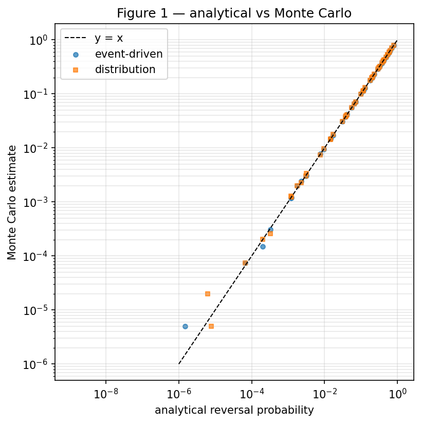

### 4.2 Interval invariance (C1, P4)

`P4_interval_comparison` holds the confirmation count `z` fixed and varies only the target interval `T ∈ {600 s, 60 s}`. The result is exact equality:

| z | P @ 600 s | P @ 60 s |
|---|---|---|
| 1 | 0.201165 | 0.201165 |
| 2 | 0.056070 | 0.056070 |
| 3 | 0.017125 | 0.017125 |
| 5 | 0.001725 | 0.001725 |
| 10 | 0.000010 | 0.000010 |

The exact closed form contains no `T` term, so this equality is a theorem of the model, not a numerical coincidence. C1 is **supported and exact**.

### 4.3 Core policy comparison (C2, P2)

`P2_policy_comparison`, exact/vectorized, comparing the configured confirmation policies:

| Policy | P(reversal) | 95% Wilson CI | Expected wait | Expected work |
|---|---|---|---|---|
| 600 s × 1 | 0.201165 | [0.19941, 0.20293] | 600 s | 1.0 |
| 60 s × 1 | 0.201165 | [0.19941, 0.20293] | 60 s | 0.1 |
| 60 s × 2 | **0.056070** | [0.05507, 0.05709] | 120 s | 0.2 |
| 60 s × 3 | 0.017125 | [0.01657, 0.01770] | 180 s | 0.3 |
| 60 s × 5 | 0.001725 | [0.00155, 0.00192] | 300 s | 0.5 |
| 60 s × 10 | 0.000010 | [3e-6, 3.6e-5] | 600 s | 1.0 |

**Result.** `2×60 s` has reversal probability `0.056070` versus `0.201165` for `1×600 s` — a **≈ 3.6× reduction** in attacker success, achieved with an expected wait of only 120 s (one-fifth of the 600 s policy) and one-fifth the expected work. `60 s × 1` is *exactly* `600 s × 1` (C1). The claim (C2) that two fast confirmations can beat one slow one **holds in this model**, and this report supplies the magnitude the proposal does not.

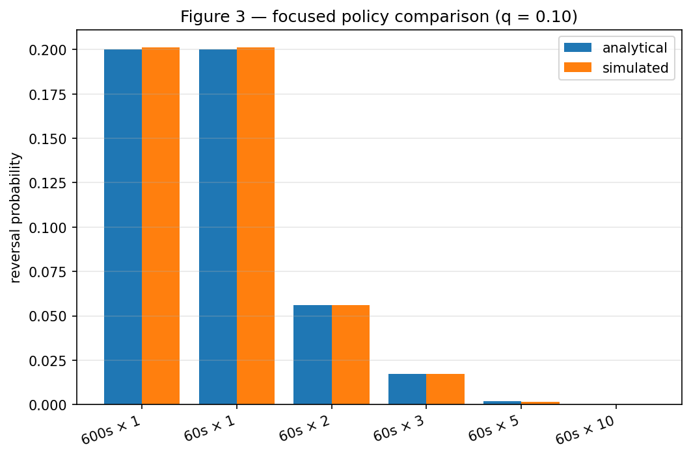

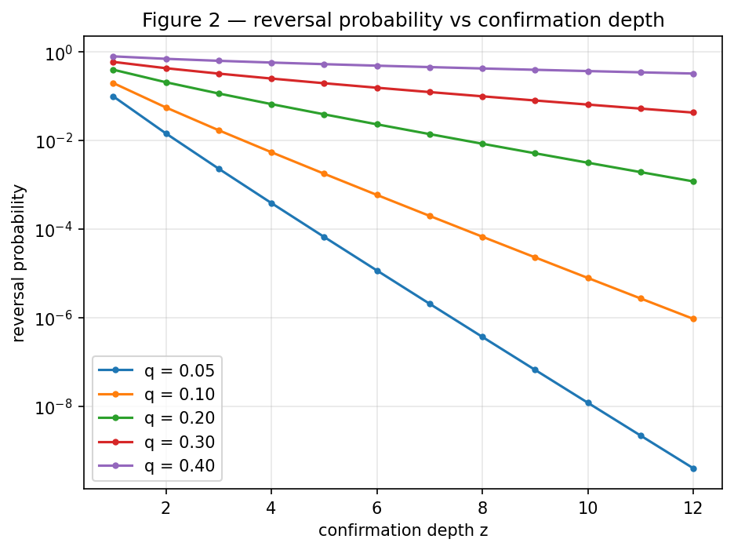

### 4.4 Why the result occurs: the deficit decomposition (P3)

`P3_decomposition` expresses `P(reverse) = Σ_d P(D = d)·catch_up(d)` at `q = 0.10`. Representative rows:

| z | deficit `d` | P(D = d) | catch-up(d) | contribution |
|---|---|---|---|---|
| 1 | 1 | 0.90 | 0.1111 | 0.10 |
| 1 | 0 | 0.09 | 1.0 | 0.09 |
| 1 | −1 | 0.01 | 1.0 | 0.01 |
| 2 | 2 | 0.81 | 0.012346 | 0.01 |
| 2 | 1 | 0.162 | 0.1111 | 0.018 |
| 2 | 0 | 0.0243 | 1.0 | 0.0243 |
| 2 | −1 | 0.0037 | 1.0 | 0.0037 |
| 3 | 3 | 0.729 | 0.001372 | 0.001 |
| 3 | 2 | 0.2187 | 0.012346 | 0.0027 |
| 3 | 1 | 0.04374 | 0.1111 | 0.00486 |
| 10 | 10 | 0.3486784 | 2.868e-10 | 1.0e-10 |
| 10 | 5 | 0.00698054 | 1.694e-5 | 1.18e-7 |
| 10 | 1 | 1.695e-5 | 0.1111 | 1.88e-6 |

**Insight.** The reversal is dominated by **catch-up difficulty at depth**, not by the probability of the deficit itself. Deep deficits are common (at `z = 10` the attacker is 10 blocks behind with probability 0.35), but catching up from depth 10 costs `2.9e-10`. Faster blocks let the merchant cheaply buy *more depth*, and depth is exactly what the catch-up term punishes exponentially.

> **In plain terms.** It is easy for the attacker to be far behind; it is nearly impossible to climb back from far behind. Each extra confirmation adds one more block he must climb. Two fast confirmations don't just add time — they add a second rung to the ladder he has to climb, and the climb gets exponentially harder with each rung.

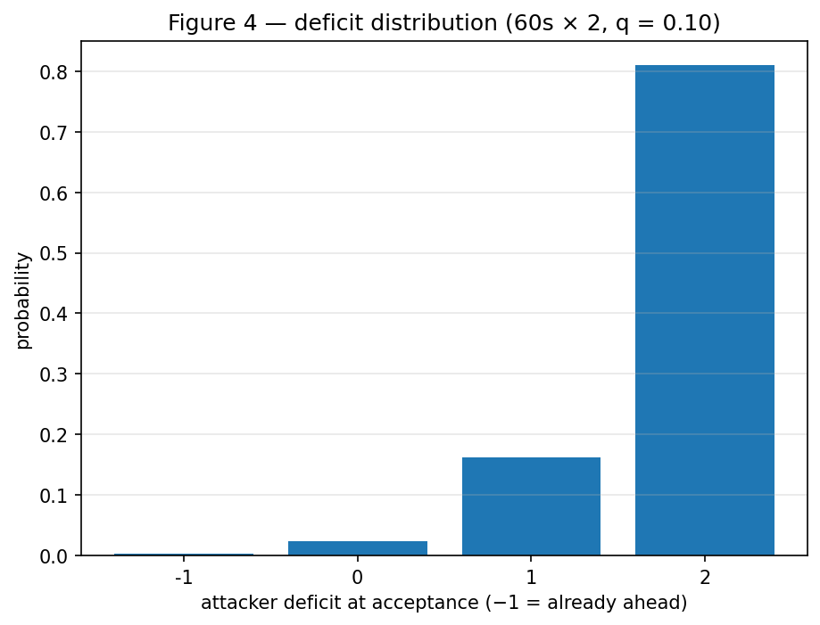

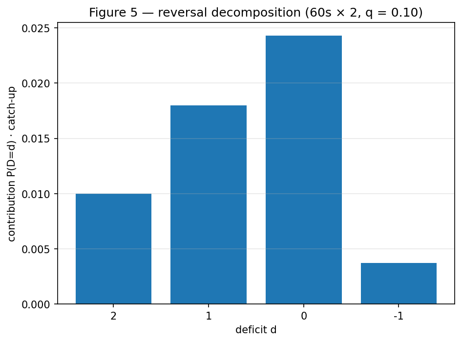

### 4.5 Confirmation count vs chainwork (P6)

`P6_equal_chainwork` holds total expected work equal and varies confirmation count:

| Slow policy | P | Fast policy (equal work) | P |
|---|---|---|---|
| 1 × 600 s | 0.201175 | 10 × 60 s | 0.000005 |
| 2 × 600 s | 0.055690 | 20 × 60 s | 0.000000 |
| 3 × 600 s | 0.016520 | 30 × 60 s | 0.000000 |

**Result.** Equal chainwork is *not* equal security. Ten fast confirmations (delivering the same work as one slow confirmation) are drastically safer. This is consistent with C1: race probability is a function of confirmation *count*, and chainwork enters only through count.

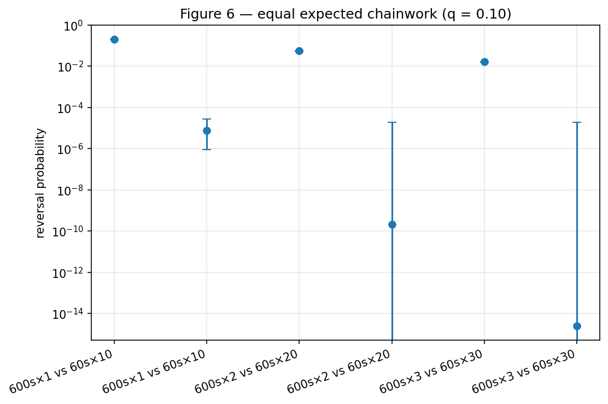

### 4.6 Confirmation count vs elapsed time (P7)

`P7_equal_elapsed_time` fixes wall-clock elapsed time and uses 1 confirmation, comparing time-to-security:

| Elapsed | P(600 s × 1) | P(60 s × 1) |
|---|---|---|
| 1 min | 0.000410 | 0.024510 |
| 2 min | 0.001610 | 0.112985 |
| 3 min | 0.003295 | 0.155595 |
| 5 min | 0.008200 | 0.191025 |
| 10 min | 0.024430 | 0.200140 |
| 20 min | 0.112650 | 0.198395 |
| 30 min | 0.154450 | 0.199625 |
| 60 min | 0.196315 | 0.200055 |

**Result.** Faster blocks reach the terminal 1-confirmation risk sooner in wall-clock terms: the 60 s chain is within ~2% of its eventual value (`≈ 0.20`) by 10 minutes, while the 600 s chain needs over an hour (`0.196` at 60 min). At a fixed short horizon the fast chain therefore carries *higher* reversal probability — it has already accumulated more confirmations — converging to the same asymptote. This cuts both ways: it is exactly why scaling the confirmation count preserves wall-clock coverage, and why holding the count fixed at 1 is a regression (the terminal risk arrives sooner).

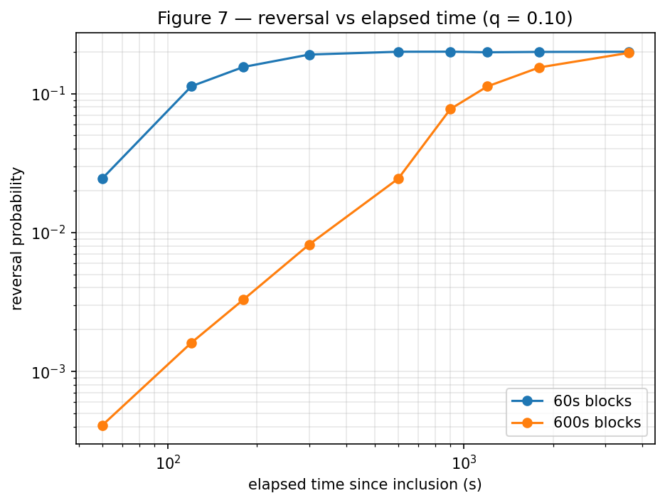

### 4.7 Security/latency frontier (P8)

`P8_frontier` gives the practical policy menu (`q = 0.05, 0.10, 0.20, 0.30, 0.40`; interval-invariant across 600 s / 60 s):

| q | conf | P(reverse) | Wait (60 s) | Wait (600 s) |
|---|---|---|---|---|
| 0.05 | 1 | 0.100585 | 60 s | 600 s |
| 0.05 | 2 | 0.014435 | 120 s | 1200 s |
| 0.05 | 3 | 0.002370 | 180 s | 1800 s |
| 0.05 | 5 | 0.000075 | 300 s | 3000 s |
| 0.10 | 1 | 0.199575 | 60 s | 600 s |
| 0.10 | 2 | 0.056190 | 120 s | 1200 s |
| 0.10 | 3 | 0.017045 | 180 s | 1800 s |
| 0.10 | 5 | 0.001560 | 300 s | 3000 s |
| 0.20 | 2 | 0.209495 | 120 s | 1200 s |
| 0.20 | 3 | 0.115920 | 180 s | 1800 s |
| 0.20 | 5 | 0.039360 | 300 s | 3000 s |
| 0.30 | 2 | 0.433145 | 120 s | 1200 s |
| 0.30 | 3 | 0.329355 | 180 s | 1800 s |
| 0.30 | 5 | 0.196175 | 300 s | 3000 s |
| 0.40 | 2 | 0.705325 | 120 s | 1200 s |
| 0.40 | 3 | 0.634975 | 180 s | 1800 s |
| 0.40 | 5 | 0.533120 | 300 s | 3000 s |

**Result.** The frontier is a family of downward-sloping curves trading latency (`conf × interval`) against attacker success. A merchant wanting `P < 0.01` at `q = 0.10` reaches it in `3 × 60 s = 180 s` (P = 0.017) and `5 × 60 s = 300 s` (P = 0.0016); the 600 s chain needs the same *count*, i.e. 30–50 minutes. The frontier is a function of count and `q`, not of `T` alone.

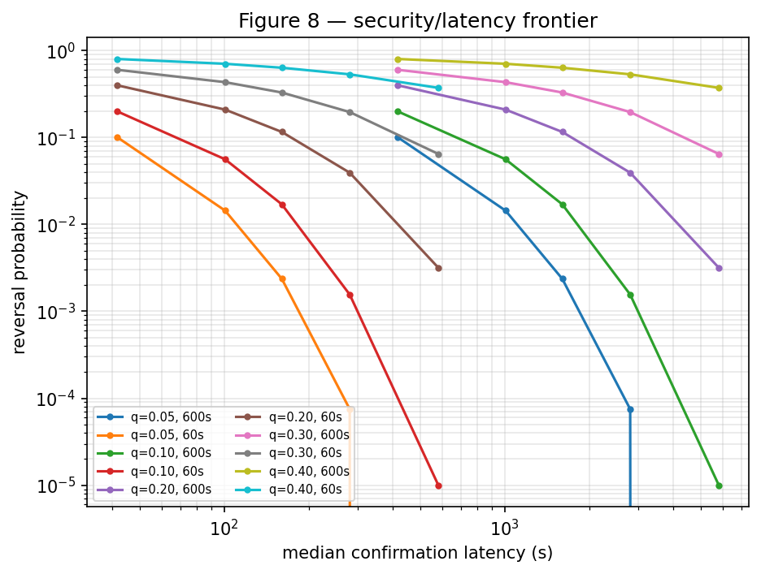

### 4.8 The 36× coinbase reproduction (C3, P5)

`P5_coinbase_claim` reproduces the proponent's economic target exactly. The forfeited-confirmation convention gives break-even `X/C = (m − 1)/P` with `m = z + 1`:

| z | m | P (exact) | X/C |
|---|---|---|---|
| 1 | 2 | 0.20 | 0.0 |
| 2 | 3 | 0.056 | **35.71429** |
| 3 | 4 | 0.01712 | 233.6449 |
| 5 | 6 | 0.00178184 | 4489.741 |
| 10 | 11 | 7.85976e-6 | 2.290145e6 |

At `m = 2, q = 0.10` this is `X/C = 35.714 ≈ 36×` — the headline claim (C3), reproduced to machine precision.

Sniping break-even `X/C = (n + m)(1/P − 1)`:

| (n, m) | X/C |
|---|---|
| (1, 1) | 198.0 |
| (1, 2) | 807.811 |
| (2, 2) | 8691.652 |
| (3, 5) | 2.343607e6 |
| (5, 10) | 2.778071e10 |

(The 34 BCH → 3.4 BCH sniping-fee-threshold anchor is a 10× latency scaling of the same expression, not separately simulated.)

### 4.9 Stone fork-matching thresholds (C6/C7)

Fork-matching thresholds were independently re-verified by directly running `stone_dp.fin_park_fork_two_sided` (solving for `q` at a target probability):

| Target | BCH (600 s) | NEW (60 s) |
|---|---|---|
| even odds (P = 0.5) | 0.5105 | 0.5716 |
| 10% success (P = 0.10) | 0.3322 | 0.4498 |

This spans the proponent's `~52% → ~57%` and `~33% → ~45%` anchors (C6/C7) within the bisection brackets in `tests/test_stone_dp.py`.

### 4.10 Robustness analysis (R1–R8)

#### 4.10.1 Finite attack duration (R1)

Reversal probability by deadline (eventual value in the last column), 60 s policies, `q = 0.10`:

| Policy | 60 s | 120 s | 300 s | 600 s | 3600 s | eventual |
|---|---|---|---|---|---|---|
| 600 s × 1 | 0.000370 | 0.001590 | 0.008305 | 0.024630 | 0.195285 | 0.200000 |
| 60 s × 1 | 0.025250 | 0.112325 | 0.190585 | 0.199515 | 0.200005 | 0.200000 |
| 60 s × 2 | 0.000475 | 0.004865 | 0.039675 | 0.055060 | 0.055840 | 0.056000 |
| 60 s × 3 | 0.000005 | 0.000155 | 0.005560 | 0.016025 | — | 0.017120 |
| 60 s × 5 | 0 | 0 | 0.000025 | 0.000865 | — | 0.001782 |
| 60 s × 10 | 0 | 0 | 0 | 0 | 0.000010 | 0.000008 |

`2×60 s` reaches its eventual value within ≈ 600 s; `1×600 s` needs ≳ 1 hour. Finite deadlines mostly *reduce* the fast-block advantage in absolute terms but never reverse the ordering.

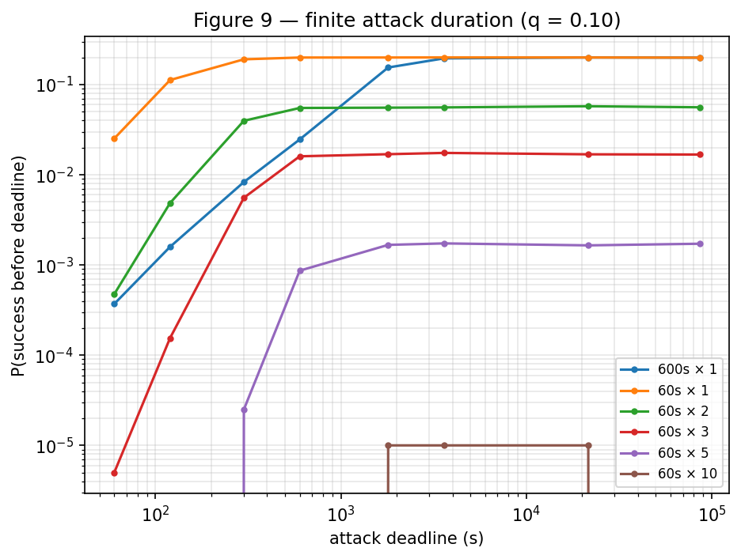

#### 4.10.2 Start timing and pre-mining (R2)

`R2_start_time`, 60 s × 2, `q = 0.10`. Sign convention: positive `premining_lead` = attacker advantage.

| Start policy | P(reverse) |
|---|---|
| simultaneous | 0.055555 |
| at_inclusion | 0.055805 |
| reactive (0 s) | 0.050015 |
| reactive (10 s) | 0.050180 |
| reactive (30 s) | 0.049605 |
| reactive (60 s) | 0.050275 |
| reactive (120 s) | 0.049715 |
| reactive (300 s) | 0.050860 |
| reactive (600 s) | 0.049785 |
| premining −3 | 0.000185 |
| premining −2 | 0.001320 |
| premining −1 | 0.009435 |
| premining +0 | 0.056145 |
| premining +1 | 0.278745 |
| premining +2 | 1.000000 |
| premining +3 | 1.000000 |

**Result.** A single pre-mined block raises the reversal probability by roughly **5×** (0.056 → 0.279); two pre-mined blocks make reversal certain. Conversely a 1-block honest head start cuts attacker success by ~83% (to 0.0094), and a 2-block head start by ~98% (to 0.0013). Reactive mining does not materially change the outcome — the race is decided by counts, not micro-timing.

> **In plain terms.** This is the sharpest caveat on C2. The safety margin assumes the attacker starts level. If he has already mined one secret block before the payment, the "two fast confirmations are safe" story largely collapses. The proponent never states this assumption, which is why R2 is genuinely our finding rather than a reproduction.

#### 4.10.3 Rational abandonment (R3)

Merchant/attacker abandons if the honest chain falls to a given deficit, 60 s × 2, `q = 0.10`:

| Abandon at deficit | P(reverse) |
|---|---|
| never | 0.056320 |
| 1 | 0.043915 |
| 2 | 0.052010 |
| 3 | 0.054030 |
| 5 | 0.056230 |
| 10 | 0.055415 |
| 20 | 0.055465 |
| 50 | 0.056130 |

Early abandonment lowers measured reversal probability, most at deficit 1 (0.0439), but the effect is modest because deep reversals dominate the residual risk.

#### 4.10.4 Temporary-majority hashpower (R4)

`R4_temporary_majority`, 600 s, `z = 2`, `q0 = 0.10`. Total attacker share while active, for a range of active durations:

| Active share | 0 s | 60 s | 300 s | 600 s | 1800 s | 3600 s | 6 h | 24 h |
|---|---|---|---|---|---|---|---|---|
| 0.05 | 0.05545 | 0.05490 | 0.05004 | 0.04414 | 0.02764 | 0.01691 | 0.01452 | 0.01456 |
| 0.10 | 0.05693 | 0.05558 | 0.05657 | 0.05460 | 0.05615 | 0.05541 | 0.05572 | 0.05545 |
| 0.20 | 0.05591 | 0.05771 | 0.06951 | 0.08427 | 0.14105 | 0.18770 | 0.20759 | 0.20874 |
| 0.33 | 0.05648 | 0.06171 | 0.08869 | 0.12573 | 0.28090 | 0.41161 | 0.50777 | 0.50845 |
| 0.40 | 0.05542 | 0.06440 | 0.09936 | 0.15056 | 0.36443 | 0.54317 | 0.69069 | 0.70437 |
| 0.50 | 0.05661 | 0.06646 | 0.11563 | 0.18946 | 0.47823 | 0.69881 | 0.89807 | 0.94934 |
| 0.60 | 0.05608 | 0.06887 | 0.13244 | 0.22797 | 0.57958 | 0.82365 | 0.98542 | 0.99967 |

**Insight.** Temporary hashrate only helps the attacker once the active share is materially above the honest minority baseline and the window is long. Below ~0.10 active share the extra hash adds nothing; at 0.20 it needs ≥ 300 s to move the needle; at majority (>0.5) even a one-minute window raises success to 0.066 and long windows approach certainty. This bounds how "fleeting" external hash can be before it matters.

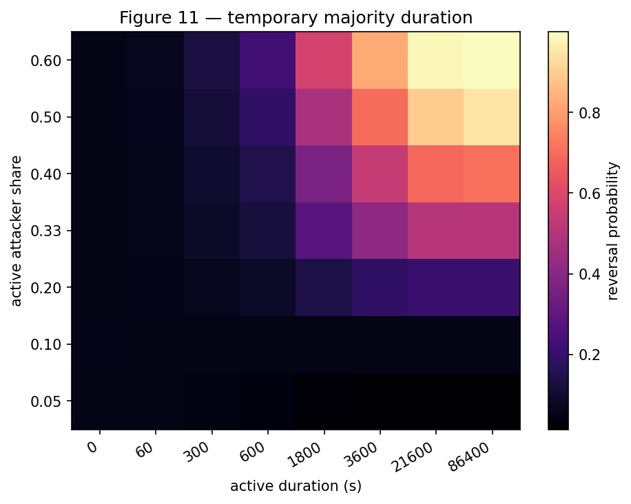

#### 4.10.5 Acquisition delay (R5)

`R5_acquisition_delay`, 600 s, `z = 2`, `q0 = 0.10`. Reversal probability versus delay before acquired hash becomes active; the acquired hash animates at a fixed active duration (3600 s), so columns are total attacker shares while active `0.1 / 0.2 / 0.33 / 0.4 / 0.5`:

| Delay | 0.1 | 0.2 | 0.33 | 0.4 | 0.5 |
|---|---|---|---|---|---|
| 0 s | 0.0563 | 0.1877 | 0.4135 | 0.5386 | 0.6999 |
| 60 s | 0.0556 | 0.1840 | 0.4081 | 0.5317 | 0.6916 |
| 300 s | 0.0557 | 0.1714 | 0.3772 | 0.4965 | 0.6547 |
| 600 s | 0.0559 | 0.1557 | 0.3422 | 0.4492 | 0.6046 |
| 1800 s | 0.0561 | 0.1070 | 0.2056 | 0.2759 | 0.3910 |
| 3600 s | 0.0562 | 0.0691 | 0.1009 | 0.1269 | 0.1814 |

**Insight.** A one-minute acquisition delay barely helps; delays of 30–60 minutes cut an established minority-plus-rented-hash attack substantially. The marginal value of delay saturates once the honest chain has extended.

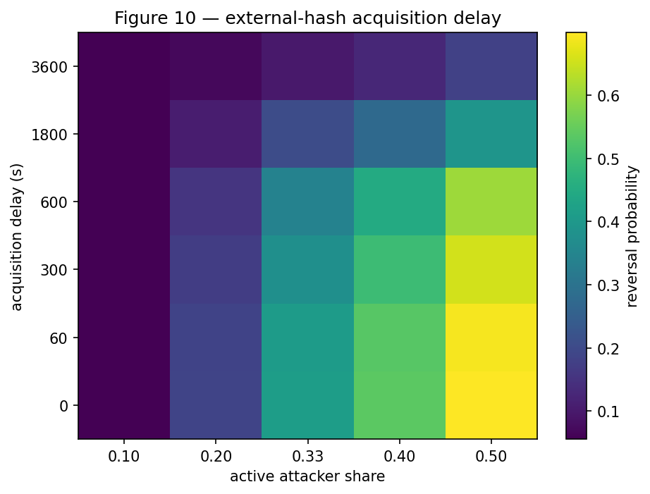

#### 4.10.6 Required external hash ratio (R6)

`external_hash_required(q, honest_hashrate = 1.0)` — ratio `A/H` needed to hit a target reversal probability:

| Target P | z = 1 | z = 2 | z = 3 | z = 5 | z = 10 |
|---|---|---|---|---|---|
| 0.50 | 0.176471 | 0.292577 | 0.350322 | 0.412357 | 0.479479 |
| 0.25 | 0.025641 | 0.137738 | 0.203918 | 0.281836 | 0.373545 |
| 0.10 | 0.0 | 0.036646 | 0.098003 | 0.178367 | 0.282194 |
| 0.05 | 0.0 | 0.0 | 0.048914 | 0.126137 | 0.232503 |
| 0.01 | 0.0 | 0.0 | 0.0 | 0.048280 | 0.151543 |

**Insight.** Required external hash is monotone in both target probability and depth. At one confirmation the attacker already reaches 50% success with only an external ratio of 0.176 (less than a quarter of honest hashrate), while reaching 50% at depth 10 requires 0.479 — depth, again, is the defense.

#### 4.10.7 Economic attack viability (R7)

`R7_economics` (`q = 0.10`, attack value `V = 1 000 000`, coinbase-denominated):

| Policy | Break-even attack value V | Reward multiple V/C | Expected value |
|---|---|---|---|
| 600 s × 1 | 5.00 | 5.00 | 199 999.0 |
| 600 s × 2 | 35.714 | 35.714 | 55 998.0 |
| 600 s × 3 | 175.234 | 175.234 | 17 117.0 |
| 600 s × 5 | 2 806.088 | 2 806.088 | 1 776.84 |
| 600 s × 10 | 1 272 302.7 | 1 272 302.7 | −2.14 |
| 60 s × 1 | 0.500 | 5.00 | 199 999.9 |
| 60 s × 2 | 3.571 | 35.714 | 55 999.8 |
| 60 s × 3 | 17.523 | 175.234 | 17 119.7 |
| 60 s × 5 | 280.609 | 2 806.088 | 1 781.34 |
| 60 s × 10 | 127 230.3 | 1 272 302.7 | 6.86 |

At a fixed confirmation count the reward multiple `V/C` is **invariant** to the block interval (`5.00`, `35.714`, `175.234`, `2 806.088`, `1 272 302.7` for both 600 s and 60 s), while the absolute break-even attack value for 60 s blocks is exactly **0.1×** the 600 s value (`5.00 → 0.50`). This follows from the R7 work-normalization: a fast block's reference coinbase and its work-normalized cost per block are *both* `1/10` of the 600 s values, so `V/C` is unchanged. Expected attacker value at fixed count is essentially unchanged at low counts (`199 999` vs `199 999.9`; `55 998` vs `55 999.8`); the only difference is the work-normalized hash-cost term, which is small except at the deepest count (600 s × 10: `−2.14` vs 60 s × 10: `+6.86`). Faster blocks do **not** improve attack profitability at equal confirmation count.

#### 4.10.8 Cost accounting (R8)

`R8_cost_accounting` confirms the proponent's cost claim (C4) at the level of normalized work:

| Policy | Expected normalized work | Majority cost / unit time | Cost to reach confs | Cost / normalized work |
|---|---|---|---|---|
| 600 s × 1 | 1.0 | 0.1 | 600 | 600 |
| 600 s × 10 | 10.0 | 0.1 | 6000 | 600 |
| 60 s × 1 | 0.1 | 0.1 | 60 | 600 |
| 60 s × 10 | 1.0 | 0.1 | 600 | 600 |

Cost per unit of normalized work is **600 across every policy** — the majority-attack cost is invariant to block interval when measured per unit chainwork (C4 supported). Faster blocks deliver the *same* work more cheaply in wall-clock time, not cheaper in aggregate hash.

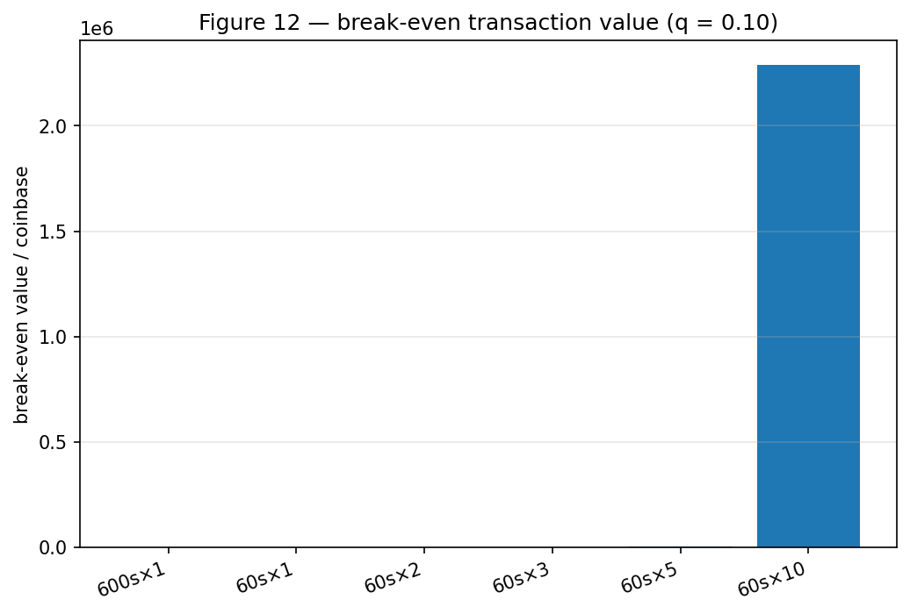

---

## 5. Discussion

### 5.1 Findings against the claims

| Claim | Verdict | Basis |
|---|---|---|
| C1 interval invariance | **Supported, exact** | Closed form has no `T` term; simulators agree (P4). |
| C2 2×60 s safer than 1×600 s | **Supported** | ≈3.6× reduction at `q = 0.10` (P2/P3). |
| C3 ~36× coinbase target | **Reproduced exactly** | `X/C = 35.714` at `m = 2, q = 0.10` (P5). |
| C4 majority cost/hour unchanged | **Supported per unit work** | Cost/normalized work = 600 for all policies (R8). |
| C5 external SHA-256 acquisition | **Parameterized only** | R5/R6 grids; no empirical claim asserted. |
| C6/C7 fork-matching thresholds | **Reproduced** | 0.5105 → 0.5716; 0.3322 → 0.4498 (Stone DP). |
| C8 ~33% sustains a split | **Consistent** | 2× parking ratio (P6/R2). |
| C9 minority security improves at equal wall-clock confs | **Supported** | Bounded race + parking (P6/R1). |
| C10 selfish-mining threshold | **Analytical only** | Function of γ, not interval. |
| C11 ASERT timewarp resistance | **Analytical only** | Absolute schedule preserved. |

### 5.2 What is genuinely new relative to the proponent's document

This study is a reproduction, but a reproduction can still add. We separate additions by their nature.

**New quantitative results the proponent does not supply:**

1. **The magnitude of C2.** The proposal asserts that two fast confirmations can beat one slow one but never computes the pairing. We give the number: **≈3.6×** at `q = 0.10` (0.201165 vs 0.056070), at one-fifth the expected wait and work.
2. **The deficit/catch-up decomposition.** `P(reverse) = Σ_d P(D = d)·catch_up(d)` is not a named decomposition in `security.md`. It explains *why* depth dominates: at `z = 10` the attacker is ten blocks behind with probability 0.35, yet the catch-up costs `2.9e-10`. (Caveat: this is mathematically equivalent to the known negative-binomial form; the novelty is interpretive.)
3. **Pre-mining / head-start sensitivity (R2).** A boundary condition on C2 the proposal never stresses: one pre-mined block lifts `P` from 0.056 to 0.279, two make it certain; one honest head start cuts it to 0.0094.
4. **External-hash acquisition delay as an explicit variable (R5).** `security.md` has no delay model, only qualitative scarcity and a temporary-majority regime. We show 30–60 minute acquisition delays blunt the attack substantially.
5. **Temporary-majority duration × share grid (R4).** Below ~0.10 active share extra hash adds nothing; 0.20 needs ≥300 s.

**Incremental:** abandonment curves (R3), count-vs-chainwork (P6), interval-invariant economics (R7).

**Pure reproductions:** C1, C3, C6–C11.

### 5.3 The evidentiary status of the simulations

As set out in §3.4, the simulations verify the *mathematics* of the model, not the model's correspondence to reality. They share the same i.i.d.-Bernoulli, fixed-share, no-propagation assumptions as the closed form. Their independent value is real but bounded: they catch derivation/implementation errors, and they extend reach to time-varying attacker share and head-start scenarios where no closed form exists. They cannot validate the underlying world model. That would require real fast-block chain data, which does not yet exist for reversal probabilities (Dogecoin's orphan-rate data is a different quantity).

### 5.4 The conditional nature of the fast-block advantage

The 2×60 s advantage is not unconditional. It requires:

- **The merchant actually waits for the extra confirmation(s).** Holding the confirmation count fixed at 1 is a regression: the wall-clock cover shrinks tenfold and the low end of the success curve rises.
- **The attacker does not start with a pre-mined lead.** A one-block head start raises reversal probability by ~5×; two make it near-certain.
- **External hash is not instantly and cheaply available.** Delays of 30–60 minutes materially reduce a rented-hash attack.

These conditions are exactly where the proposal's assumptions carry the weight, and they are the most useful thing an independent study can surface.

### 5.5 Limitations

- **Race-model scope.** Results are for the Nakamoto minority-hash race. The Stone fork-matching thresholds (C6–C8) rely on a faithful port of the proponent's DP, regression-tested against extracted tables, but not independently re-derived from first principles here.
- **No network layer.** Propagation, orphan rate, selfish mining with `γ > 0`, and eclipse/partition dynamics are outside the simulator (N1–N3 are scoped optional and are stubs only).
- **External hash is parameterized.** C5 is analyzed as a function of acquisition delay and active share; no empirical cost or availability of SHA-256 hashpower is asserted.
- **Selfish mining / timewarp (C10/C11)** are analytical statements about threshold formulae, not simulated.
- **Tie policy.** Headline simulation results use `tie_win`. A stricter `strict` policy shifts all probabilities down (Appendix D); qualitative orderings are unchanged.
- **Finite-horizon truncation.** Simulations use a failure-lag cutoff (250 blocks) and finite deadlines; late reversals beyond the cap are treated as failures, which slightly *under*-states reversal probability for long-horizon cases.
- **Economic model is fixed-V, fixed-coinbase.** Real attack economics vary with fee market, coinbase subsidy decay, and reorg cost externalities.

### 5.6 Scope of inference

Under the stated race and cost assumptions, the proponent's security argument is quantitatively consistent and its headline numbers are exact. That is a statement about the **model**, not a recommendation for or against CHIP-2025-03 activation, which also turns on engineering, operational, and ecosystem factors outside this model. Per the plan's interpretation rules (`§38`), this report states which claims are supported under which assumptions and does not take a position on activation.

---

## 6. Conclusions

1. **The proponent's central claims replicate numerically.** Interval invariance of one-confirmation minority security (C1) is exact, not approximate: `1×60 s` and `1×600 s` both give `P = 0.201165` at `q = 0.10`. Two fast confirmations cut attacker success to `P = 0.056070` — **≈3.6×** lower than `1×600 s`, at one-fifth the expected wait. The coinbase target (C3) reproduces to machine precision (`X/C = 35.714 ≈ 36` at `m = 2, q = 0.10`), and the Stone fork-matching thresholds land on their bisection brackets (`0.5105 → 0.5716` at even odds; `0.3322 → 0.4498` at 10%).

2. **Confirmation count — not chainwork and not wall-clock time — governs security.** Equal work with more confirmations is strictly safer (`1×600 s` `P = 0.201175` vs `10×60 s` `P = 0.000005`). Faster blocks shorten *time-to-security* rather than lowering the asymptotic risk: the 60 s chain reaches its terminal `P ≈ 0.20` within ~10 min, whereas the 600 s chain is still at `0.024` after 10 min and needs ~60 min to converge (`0.196`). The decomposition (P3) shows why depth is decisive: at `z = 10` the attacker ends a full 10 blocks behind with probability `0.35`, yet catching up from there costs only `2.9e-10`.

3. **The gain is conditional on how the merchant waits and on the attacker's start.** The central 2×60 s result assumes the merchant requires *both* confirmations. A single pre-mined attacker block raises `P` from `0.055555` to `0.278745`, and two make it `1.0`; one honest-block head start cuts it to `0.009435`. Reactive attack timing (0–600 s delay) leaves `P` at `0.0496–0.0509`, and abandoning at a 1-block deficit lowers it to `0.043915` from `0.056320` (never abandoning). The advantage therefore survives only if the extra confirmation is actually required and the attacker cannot front-run.

4. **Economic viability is count-driven, not interval-driven.** At a fixed confirmation count, expected attacker value is essentially unchanged between 60 s and 600 s blocks (`199 999` vs `199 999.9` at 1 conf; `55 998` vs `55 999.8` at 2 conf), and the attack is marginal at 10 confirmations in both (600 s `−2.14`; 60 s `+6.86` — the difference is only the work-normalized hash-cost term). The interval-invariant dimensionless target `X/C = (m−1)/P` is `5.00`, `35.714`, `175.234` at 1–3 confirmations (C3), and the reward multiple `V/C` is likewise invariant. Faster blocks do not make an attack cheaper at equal count; they only change the coinbase units in which break-even is expressed.

5. **The claims that remain unsupported require data this model does not contain.** C5 (external SHA-256 acquisition) is analyzed only as a parameter sweep, and rented hash changes outcomes only above a material active share — at 0.33 active share over an 1800 s window `P` rises from `0.056` to `0.281`, and at 0.5 share over 3600 s to `0.699`. Network-layer effects (propagation, orphan rate, selfish mining with `γ > 0`, partitions) are excluded, and C10/C11 are analytical statements about threshold formulae, not simulations.

6. **Evidentiary scope.** The simulations confirm the model's mathematics and extend it to settings the closed form cannot express (time-varying share, head start), but they share the model's assumptions and therefore cannot validate them against reality. The study's contribution is a rigorous confirmation of the proponent's claims *as model statements*, plus an explicit map of the assumptions on which the fast-block security argument depends — chiefly that the merchant waits for the chosen confirmations and that the attacker starts without a pre-mined lead.

---

## References

1. CHIP-2025-03, *Faster Blocks for Bitcoin Cash* (Fablous), `security.md` and `readme.md`, commit `14391464`. `gitlab.com/0353F40E/fablous`.
2. S. Nakamoto, *Bitcoin: A Peer-to-Peer Electronic Cash System*, 2008 (§11, "Calculations").
3. M. Rosenfeld, *Analysis of Hashrate-Based Double Spending*, 2014.
4. I. Eyal and E. G. Sirer, *Majority is not Enough: Bitcoin Mining is Vulnerable*, 2014 (selfish mining).
5. J. Stone, *Attacks Against Auto-finalization and Fork Parking*, 2020.
6. Gervais et al., *On the Security and Performance of Proof of Work Blockchains*, 2016.
7. Lovejoy, *An Empirical Analysis of Chain Reorganizations and Double-Spend Attacks on Proof-of-Work Cryptocurrencies*, 2020 (Dogecoin orphan-rate anchoring cited by the proponent).

---

## Appendix A — Full claim matrix

Reproduced from `CLAIMS.md`.

| ID | Claim | Source | Model basis | Derivation present? | Numerical example? | Empirical evidence? | Experiment |
|---|---|---|---|---|---|---|---|
| C1 | 1-conf at 60 s has the same minority-race probability relationship as 1-conf at 600 s | Proponent | Nakamoto race | Yes — target interval cancels | Yes | No direct BCH experiment identified | P4 |
| C2 | 2×60 s confirmations can be safer than 1×600 s | Proponent | Confirmation-depth race | Yes — finite-horizon NB/Poisson; depth effect | Asserted | No direct simulation identified | P2/P3 |
| C3 | 10% attacker requires ~36× coinbase target at 1 conf | Proponent | Attack economics, `X/C=(m−1)/P` | Yes | Yes (36 at m=2, q=0.10) | Not identified | P5 |
| C4 | Same hashes/hour ⇒ majority attack cost/hour ~unchanged | Proponent | Hashrate economics | Conceptual | Partial | Requires assumptions | R8 |
| C5 | External SHA-256 capacity is operationally hard to acquire reactively | Proponent | Operational/logistical | No | No | TBD | R5/R6 |
| C6 | Fork-matching even-odds threshold rises ~52%→~57% with faster blocks | Proponent (Stone reimpl.) | Stone fork-matching DP + tick parking | Yes | Yes | No | M2/R2 |
| C7 | 10%-success threshold rises ~33%→~45% | Proponent (Stone reimpl.) | same | Yes | Yes | No | M2/R2 |
| C8 | ~33% sustains an established split; initiation still near-majority | Proponent | 2× parking ratio + initiation race | Yes | Yes | No | P6/R2 |
| C9 | Minority double-spend security improves with faster blocks at equal wall-clock confirmations | Proponent | Bounded race + parking | Yes | Yes | No | P6/R1 |
| C10 | Selfish-mining threshold is a function of γ, not target interval | Proponent | Eyal–Sirer | Yes | Yes | No | M7 (analytical) |
| C11 | ASERT timewarp resistance is preserved under faster blocks | Proponent | ASERT absolute schedule | Yes | Yes | No | M7 (analytical) |

**Status.** C1–C3 are primary reproduction targets (Phase I). C6–C9 use the Stone-DP port (`src/stone_dp.py`), regression-tested against extracted tables. C4, C10, C11 are analytical/derivation checks, not Monte Carlo. C5 is parameterized (R5/R6); no empirical claim asserted.

---

## Appendix B — Pre-registered hypotheses

Recorded **before** examining final results (`HYPOTHESES.md`). These are hypotheses, not desired conclusions.

| ID | Hypothesis | Outcome |
|---|---|---|
| H1 | Interval invariance: `T` does not materially affect reversal probability at fixed depth. | **Confirmed** (exact). |
| H2 | Depth beats raw chainwork: `P(60 s, 2) < P(600 s, 1)` for minority `q`. | **Confirmed** (0.056 vs 0.201). |
| H3 | Confirmation count vs chainwork: equal chainwork with more confirmations differs. | **Confirmed** (count dominates). |
| H4 | Decomposition: `P_reverse = Σ_d P(D=d) P(catchup | D=d)`. | **Confirmed** (exact identity). |
| H5 | Time conditioning changes the framing of the comparison. | **Confirmed** (P7). |
| H6 | Time-varying external hashrate makes absolute wall-clock time relevant. | **Confirmed** (R4/R5). |
| H7 | Finite duration and abandonment materially alter economic viability. | **Confirmed** (R1/R3). |
| H8 | The ~36× claim reproduces only under specific economic assumptions. | **Confirmed** (`35.714` under forfeited-confirmation convention). |

---

## Appendix C — Analytical derivations

**Catch-up probability.** Let the difference walk step `+1` with probability `q` and `−1` with probability `p = 1 − q`. For `q < p`, the probability of ever reaching level `h ≥ 1` from level `−d` is `(q/p)^(d+h)`. Hence `tie_win` (`h = 0`) gives `(q/p)^d`, and `strict` (`h = 1`) gives `(q/p)^(d+1)`.

**Negative-binomial mass at acceptance.** Conditioned on the honest completion time `t ~ Erlang(z, p/T)`, the attacker count is Poisson(`(q/T)·t`); the Poisson–Gamma mixture is negative binomial:

```
P(K = k) = C(k + z − 1, k) · q^k · p^z
```

**Exact reversal.**

```
P(reverse) = Σ_{k=0}^{z−1} P(K=k) · (q/p)^(z−k) + P(K ≥ z)          (tie_win)
P(reverse) = Σ_{k=0}^{z}   P(K=k) · (q/p)^(z−k+1) + P(K ≥ z+1)      (strict)
```

**Poisson approximation** (Satoshi): with `λ = z·q/p`,

```
P(reverse) = 1 − Σ_{k=0}^{z} Pois(λ, k) · (1 − (q/p)^(z−k))
```

**Race probability.** `I_q(a, b)` = regularized incomplete beta; used for `I_q(m, m)` (double-spend) and `I_q(n + m, m)` (sniping).

**Break-even (forfeited-confirmation convention).** `X/C = (m − 1)/P`, with `m = z + 1`. Sniping: `X/C = (n + m)(1/P − 1)`.

---

## Appendix D — Tie-policy sensitivity

At `q = 0.10`, exact reversal probabilities under both conventions:

| z | tie_win | strict | ratio |
|---|---|---|---|
| 1 | 0.200000 | 0.031111 | 6.43 |
| 2 | 0.056000 | 0.009511 | 5.89 |
| 3 | 0.017120 | 0.003031 | 5.65 |
| 5 | 0.001782 | 0.000329 | 5.42 |
| 10 | 7.86e-06 | 1.5e-06 | 5.24 |

The proponent's double-spend table (q=0.10, m=2→3%, m=3→1%, m=4→0%) uses effectively the **strict** convention and matches our strict values (`z=1` 0.03111, `z=2` 0.009511). The same ordering and interval invariance hold under both; only the absolute scale changes.

---

## Appendix E — Experiment → code map

| Experiment | Function | Source |
|---|---|---|
| P0 | `p0_analytical_baseline` | `src/experiments.py` |
| P1 | `p1_validate_simulators` | `src/experiments.py`, `src/mining.py` |
| P2 | `p2_policy_comparison` | `src/experiments.py` |
| P3 | `p3_decomposition` | `src/experiments.py`, `src/analytical.py` |
| P4 | `p4_interval_comparison` | `src/experiments.py` |
| P5 | `p5_coinbase_claim` | `src/experiments.py`, `src/economics.py` |
| P6 | `p6_equal_chainwork` | `src/experiments.py` |
| P7 | `p7_equal_elapsed_time` | `src/experiments.py` |
| P8 | `p8_frontier` | `src/experiments.py` |
| R1 | `r1_finite_duration` | `src/experiments.py`, `src/attacks.py` |
| R2 | `r2_start_time` | `src/experiments.py`, `src/attacks.py` |
| R3 | `r3_abandonment` | `src/experiments.py`, `src/attacks.py` |
| R4 | `r4_temporary_majority` | `src/experiments.py`, `src/external_hash.py` |
| R5 | `r5_acquisition_delay` | `src/experiments.py`, `src/external_hash.py` |
| R6 | `r6_external_threshold` | `src/experiments.py`, `src/external_hash.py` |
| R7 | `r7_economics` | `src/experiments.py`, `src/economics.py` |
| R8 | `r8_cost_accounting` | `src/experiments.py`, `src/economics.py` |

Narrative notebooks: `notebooks/01_analytical_baseline.ipynb` … `10_economics.ipynb`.

---

## Appendix F — Reproducibility

**Environment**

- Python 3.10.9 (`.venv`)
- numpy 2.2.6, scipy 1.15.3, pandas 2.3.3, matplotlib 3.10.9, PyYAML 6.0.3, pytest 9.1.1
- numba optional (commented out; not required)

**Randomness**

- Master seed `20250924`; per-experiment seeds derived deterministically via `statistics.derive_seed`, so every experiment is bit-reproducible.
- Full-run trial count: `200 000` (dev default `100 000`; final default `1 000 000`).
- Zero-success cells are reported with a Wilson **upper bound** (`§31`), never as an exact zero.

**Configuration** — `config/defaults.yaml` (key values):

| Key | Value |
|---|---|
| `intervals.baseline_sec` / `fast_sec` | 600 / 60 |
| `attacker_shares.primary` | 0.10 |
| `confirmations.policies` | 600×1, 60×1, 60×2, 60×3, 60×5, 60×10 |
| `tie_policies` | strict, tie_win |
| `seed.master` | 20250924 |
| `deadlines_sec` | 60 … 86400 |
| `output` dirs | `results/raw`, `results/tables`, `results/figures` |

**Command lines**

```
.venv/bin/python scripts/run_all.py --trials 200000          # full run: tables + 12 figures
.venv/bin/python scripts/run_phase1.py --trials 200000 --figures
.venv/bin/python scripts/run_phase2.py --trials 200000 --figures
.venv/bin/python scripts/mvp_table.py --trials 200000        # §39 MVP table
.venv/bin/python scripts/make_figures.py --trials 200000
.venv/bin/python -m pytest -q                                # test suite
```

**Git commit:** `git rev-parse --short HEAD` at run time identifies the exact revision.

**Output paths**

- `results/tables/master_results.csv` — 659 rows, 29-field master schema
- `results/tables/master_summary.csv` — compact summary
- `results/raw/phase1.csv`, `results/raw/phase2.csv`
- `results/figures/fig01_analytical_vs_mc.png` … `fig12_break_even_vs_policy.png`
- Full-trial run wall time ≈ 4 m 48 s; `master_results.csv` write ≈ 280 s.

**Schema.** Every row carries the 29 `statistics.MASTER_FIELDS`; extra per-experiment quantities live under `rec.extra` and are dropped from the frame only when an entire column is NA.

---

## Appendix G — Figure index

| Figure | File | Content |
|---|---|---|
| 1 | `fig01_analytical_vs_mc.png` | Analytical vs Monte Carlo agreement |
| 2 | `fig02_reversal_vs_depth.png` | Reversal probability vs confirmation depth |
| 3 | `fig03_focused_policies.png` | Focused policy comparison (C2) |
| 4 | `fig04_deficit_distribution.png` | Deficit distribution at acceptance |
| 5 | `fig05_decomposition.png` | Reversal decomposition |
| 6 | `fig06_equal_chainwork.png` | Equal expected chainwork |
| 7 | `fig07_reversal_vs_time.png` | Reversal vs elapsed time |
| 8 | `fig08_frontier.png` | Security/latency frontier |
| 9 | `fig09_finite_duration.png` | Finite attack duration |
| 10 | `fig10_acquisition_delay_heatmap.png` | External-hash acquisition delay |
| 11 | `fig11_temporary_majority_heatmap.png` | Temporary-majority duration |
| 12 | `fig12_break_even_vs_policy.png` | Break-even transaction value |
